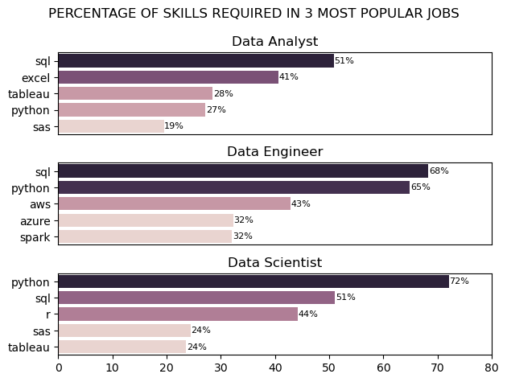

# Overview 

Welcome to my data analysis project, which provides an in-depth examination of the global data job market. This project aims not only to offer valuable insights into the current job landscape but also to showcase my skills and dedication. 

Using Python and other analytical tools, I have successfully addressed four key questions related to data jobs. Additionally, visualizations have been incorporated to enhance clarity and improve the comprehensibility of the findings. Below are the results. 

*DISCLAIMER* 
- The main data is sourced from [Luke Barousse's Python Course](https://lukebarousse.com/python) 
- Due to the limited availability of data in Vietnam, my analysis will primarily focus on the job market in the United States.
- The findings are based on available data and may not reflect real-time market conditions. 

# Questions 

This project aims at answering the following questions: 

1. What are the most in-demand skills for the top three most popular data roles in the United States?
2. What are the trends in the top three most in-demand skills for Data Analysts? 
3. What are the salaries of the six most common jobs in the United States 
4. What are the most optimal skills for Data Analysts? 

# Tools I used 
To conduct an in-depth analysis of the data analyst job market, I leveraged several essential tools:

- Python: The core of my analysis, enabling me to process data and extract key insights. I specifically used the following Python libraries:
    -  Pandas: For data manipulation and analysis.
    - Matplotlib: To create visual representations of the data.
    - Seaborn: For generating more sophisticated and detailed visualizations.
- Visual Studio Code: My primary tool for writing and executing Python scripts.
- Git & GitHub: Crucial for version control, code management, and sharing my work, facilitating collaboration and project tracking.
# What I learned from this project 

Throught this simple yet eye-opening project, I learned 3 main lessons: 

* **Integrating Programming and Machine Learning in Data Analysis** 

This project helped me understand how Python and machine learning techniques can be used to analyze real-world data. I applied various libraries like Pandas,Matplotlib to clean, process, and interpret data, making the analysis more insightful and efficient.

* **Strengthening Logical and Analytical Thinking** 

 Working on this project required me to break down complex problems into smaller, manageable steps. I improved my ability to think critically, debug errors, and optimize my code for better performance, which strengthened my overall problem-solving skills.

* **Mastering Data Visualization and Presentation**


I learned how to effectively use data visualization libraries like Matplotlib and Seaborn to present findings in a clear and visually appealing way. This skill is essential for communicating insights to others, making data-driven decisions more accessible and impactful.

# The project

Here's a deep insight into my project
## Data preparation & clean up 

I begin by importing the required libraries and loading the dataset. This is followed by data cleaning to maintain data quality. 

``` python 
#Import 
import ast
import pandas as pd
import seaborn as sns
from datasets import load_dataset
import matplotlib.pyplot as plt  

#Load datasets 
dataset = load_dataset('lukebarousse/data_jobs')
df = dataset['train'].to_pandas() 
``` 
To see a detailed version of the data clean up, visit [1_Skills_Demand.ipynb](1_Skills_Demand.ipynb) 
``` python 
# Data Cleanup
df['job_posted_date'] = pd.to_datetime(df['job_posted_date'])
df['job_skills'] = df['job_skills'].apply(lambda x: ast.literal_eval(x) if pd.notna(x) else x)
``` 

## 1.  What are the most in-demand skills for the top three most popular data roles in the United States? 

### Brief analysis 
Detailed version: [1_Skills_Demand.ipynb](1_Skills_Demand.ipynb)

To identify the top free most popular data roles in the United States, I first filtered the dataset to include only job listings based in the U.S. 

``` python 
df_US = df[df['job_country'] == 'United States']
```

To find the three most popular data roles, I used the following python code

``` python 
df_US['job_title_short'].value_counts()
``` 
Result: the three most popular data roles are Data Analyst, Data Scientist, Data Engineer 

Next, I determine how often each skill appears in job postings by calculating the percentage—dividing the total number of times a skill is mentioned by the total number of job listings. 

<div>
<style scoped>
    .dataframe tbody tr th:only-of-type {
        vertical-align: middle;
    }

    .dataframe tbody tr th {
        vertical-align: top;
    }

    .dataframe thead th {
        text-align: right;
    }
</style>
<table border="1" class="dataframe">
  <thead>
    <tr style="text-align: right;">
      <th></th>
      <th>job_skills</th>
      <th>job_title_short</th>
      <th>skill_count</th>
      <th>job_count</th>
      <th>skill_perc</th>
    </tr>
  </thead>
  <tbody>
    <tr>
      <th>0</th>
      <td>python</td>
      <td>Data Scientist</td>
      <td>42379</td>
      <td>58830</td>
      <td>72.036376</td>
    </tr>
    <tr>
      <th>1</th>
      <td>sql</td>
      <td>Data Analyst</td>
      <td>34452</td>
      <td>67816</td>
      <td>50.802171</td>
    </tr>
    <tr>
      <th>2</th>
      <td>sql</td>
      <td>Data Scientist</td>
      <td>30034</td>
      <td>58830</td>
      <td>51.052184</td>
    </tr>
    <tr>
      <th>3</th>
      <td>excel</td>
      <td>Data Analyst</td>
      <td>27519</td>
      <td>67816</td>
      <td>40.578919</td>
    </tr>
    <tr>
      <th>4</th>
      <td>r</td>
      <td>Data Scientist</td>
      <td>26022</td>
      <td>58830</td>
      <td>44.232534</td>
    </tr>
    <tr>
      <th>...</th>
      <td>...</td>
      <td>...</td>
      <td>...</td>
      <td>...</td>
      <td>...</td>
    </tr>
    <tr>
      <th>1865</th>
      <td>clojure</td>
      <td>Software Engineer</td>
      <td>1</td>
      <td>1814</td>
      <td>0.055127</td>
    </tr>
    <tr>
      <th>1866</th>
      <td>vb.net</td>
      <td>Senior Data Scientist</td>
      <td>1</td>
      <td>12946</td>
      <td>0.007724</td>
    </tr>
    <tr>
      <th>1867</th>
      <td>fortran</td>
      <td>Machine Learning Engineer</td>
      <td>1</td>
      <td>921</td>
      <td>0.108578</td>
    </tr>
    <tr>
      <th>1868</th>
      <td>planner</td>
      <td>Cloud Engineer</td>
      <td>1</td>
      <td>423</td>
      <td>0.236407</td>
    </tr>
    <tr>
      <th>1869</th>
      <td>nltk</td>
      <td>Senior Data Engineer</td>
      <td>1</td>
      <td>9289</td>
      <td>0.010765</td>
    </tr>
  </tbody>
</table>
<p>1870 rows × 5 columns</p>
</div>

Finally, I visualize the data using the `seaborn` library

``` python 
import seaborn as sns 

fig, ax = plt.subplots(3,1) 

for i,job in enumerate(job_roles):
    df_plot = df_total[df_total['job_title_short'] == job].head(5) 
    sns.barplot(df_plot,x='skill_perc',y='job_skills',hue='skill_perc',ax=ax[i]) 
    ax[i].set(title=job, ylabel='', xlabel='')
    ax[i].legend().set_visible(False)
    ax[i].set_xlim(0,80)
    
    # label the percentage on the bars
    for j, value in enumerate(df_plot['skill_perc']): 
        ax[i].text(value + 0.1, j, f'{value:.0f}%', va='center',fontsize=8) 

    if i != 2: 
        ax[i].xaxis.set_visible(False)

fig.suptitle('PERCENTAGE OF SKILLS REQUIRED IN 3 MOST POPULAR JOBS')

plt.tight_layout()
```
### Result 



### Insight 

* **SQL is essential for all roles**

SQL is a fundamental skill in the data industry, with the highest demand for Data Engineers (68%), followed by Data Analysts (51%) and Data Scientists (51%). Its widespread use across all three roles highlights its importance in database management, data querying, and structured data processing. Mastering SQL is crucial for anyone pursuing a career in data. 

* **Python Dominates in Data Science & Engineering**

Python is the most in-demand skill for Data Scientists (72%) and is also heavily required for Data Engineers (65%). It plays a key role in data analysis, automation, and machine learning. However, its demand is significantly lower for Data Analysts (27%), suggesting that analysts often rely on other tools for data manipulation and reporting rather than extensive programming. 

* **Data Analysts Rely on Business Intelligence Tools**

Unlike Data Scientists and Engineers, Data Analysts primarily use business intelligence tools like Excel (41%) and Tableau (28%) to analyze and visualize data. Their focus is more on extracting insights and presenting findings rather than building complex models or handling large-scale data processing. This highlights the importance of visualization and communication skills in the analyst role.

## 2. What are the trends in the top three most in-demand skills for Data Analysts? 

### Brief Analysis 
Detailed version: [2_Skills_Trend.ipynb](2_Skills_Trend.ipynb)

In this analysis, I will focus mainly on the 'Data Analyst' role in the United States for the sake of data variety.  

```python 
#Filtering Data Analyst jobs in the United States 
df_US = df_exploded[(df_exploded['job_title_short'] == 'Data Analyst') & (df_exploded['job_country'] == 'United States')]
```

Next, to find the trend of all skills, I will create a pivot table that count the amount of time each skills appear each month by using `.pivot_table()` 

``` python 
#Creating a pivot table to track the number of skills posted each month.
df_pivot = df_US.pivot_table(index='job_posted_month',columns='job_skills',aggfunc='size',fill_value=0)
```

Here's the pivot table 

<div>
<style scoped>
    .dataframe tbody tr th:only-of-type {
        vertical-align: middle;
    }

    .dataframe tbody tr th {
        vertical-align: top;
    }

    .dataframe thead th {
        text-align: right;
    }
</style>
<table border="1" class="dataframe">
  <thead>
    <tr style="text-align: right;">
      <th>job_skills</th>
      <th>sql</th>
      <th>excel</th>
      <th>tableau</th>
      <th>python</th>
      <th>sas</th>
    </tr>
    <tr>
      <th>job_posted_mon</th>
      <th></th>
      <th></th>
      <th></th>
      <th></th>
      <th></th>
    </tr>
  </thead>
  <tbody>
    <tr>
      <th>Jan</th>
      <td>14.161716</td>
      <td>11.056050</td>
      <td>7.657977</td>
      <td>6.937733</td>
      <td>5.638832</td>
    </tr>
    <tr>
      <th>Feb</th>
      <td>13.657527</td>
      <td>11.152785</td>
      <td>7.225384</td>
      <td>6.975341</td>
      <td>5.225039</td>
    </tr>
    <tr>
      <th>Mar</th>
      <td>13.862748</td>
      <td>11.434833</td>
      <td>7.752138</td>
      <td>7.232177</td>
      <td>5.319926</td>
    </tr>
    <tr>
      <th>Apr</th>
      <td>13.813221</td>
      <td>10.934752</td>
      <td>7.674488</td>
      <td>7.202608</td>
      <td>5.585346</td>
    </tr>
    <tr>
      <th>May</th>
      <td>13.726533</td>
      <td>11.264160</td>
      <td>7.615806</td>
      <td>7.174387</td>
      <td>5.169388</td>
    </tr>
    <tr>
      <th>Jun</th>
      <td>13.362592</td>
      <td>11.121487</td>
      <td>7.601083</td>
      <td>7.512373</td>
      <td>4.594267</td>
    </tr>
    <tr>
      <th>Jul</th>
      <td>13.267901</td>
      <td>10.770952</td>
      <td>7.795972</td>
      <td>7.312856</td>
      <td>5.065094</td>
    </tr>
    <tr>
      <th>Aug</th>
      <td>13.325007</td>
      <td>10.659225</td>
      <td>7.614847</td>
      <td>7.903673</td>
      <td>4.980290</td>
    </tr>
    <tr>
      <th>Sep</th>
      <td>13.122534</td>
      <td>10.297902</td>
      <td>7.736291</td>
      <td>7.027274</td>
      <td>4.894505</td>
    </tr>
    <tr>
      <th>Oct</th>
      <td>13.470798</td>
      <td>10.058614</td>
      <td>7.478543</td>
      <td>7.185472</td>
      <td>5.024074</td>
    </tr>
    <tr>
      <th>Nov</th>
      <td>13.452974</td>
      <td>10.040608</td>
      <td>7.518994</td>
      <td>6.870579</td>
      <td>5.187320</td>
    </tr>
    <tr>
      <th>Dec</th>
      <td>12.613473</td>
      <td>10.408846</td>
      <td>7.371510</td>
      <td>7.344209</td>
      <td>5.323869</td>
    </tr>
  </tbody>
</table>
</div>

Finally, I visualize the output 

``` python 
#Plotting the data 

sns.lineplot(data=df_plot)
plt.legend().remove()
ax = plt.gca() 
ax.set_xlabel('Month')
ax.set_ylabel('Percentage of Job Postings')
import matplotlib.ticker as mtick
ax.yaxis.set_major_formatter(mtick.FuncFormatter(lambda y, _: '{:.0%}'.format(y / 100)))
for i in range(5): 
    column_name = df_plot.columns[i]
    y_position = df_plot.iloc[-1, i]

    # Adjust the position only for 'python'
    if column_name == 'python':
        plt.text(x=11.2, y=y_position - 0.5,  # Move Python label up
                 s=column_name, color='black')
    else:
        plt.text(x=11.2, y=y_position, 
                 s=column_name, color='black')

ax.spines['top'].set_visible(False)
ax.spines['right'].set_visible(False)
plt.suptitle('Top 5 skills in Data Analyst job postings in the US')
plt.tight_layout()

```
### Result

 

### Insight 

* **SQL Remains the Most In-Demand Skill Throughout the Year**

SQL consistently appears in the highest percentage of Data Analyst job postings, fluctuating around 14% before slightly declining toward the end of the year. This reinforces SQL as a fundamental skill for data analysts.

* **Excel is the Second Most Sought-After Skill**

Excel maintains a strong demand but trends downward over the months, indicating a possible shift towards more advanced tools for data manipulation and visualization. 

* **Python and Tableau Are Steadily Growing in Importance**

Both Python and Tableau show relatively stable demand, with minor fluctuations. This suggests that companies are increasingly looking for analysts who can perform programming-based analysis and data visualization alongside traditional tools like Excel.

## 3. What are the salaries of the six most common jobs in the United States?  
### Brief analysis 

Detailed version: [3_Salary_Analysis.ipynb](3_Salary_Analysis.ipynb) 

To identify the six most common jobs in the United States, I counted the occurrences of each job title in the dataset and selected the six with the highest counts. 

The top six job titles were: Data Analyst, Data Scientist, Data Engineer, Senior Data Scientist, Senior Data Analyst, and Senior Data Engineer.

Next, I filtered the dataset to include only job postings for these six roles.

Finally, I visualize the output using a boxplot. 

``` python 
import seaborn as sns 
import matplotlib.ticker as mtick

#Plot the boxplot in order of highest to lowest median salary 
order = df_US.groupby('job_title_short')['salary_year_avg'].median().sort_values(ascending=False).index.tolist() 

sns.boxplot(df_US,x='salary_year_avg',y='job_title_short',order=order) 
plt.xlim(0,600000)
plt.xlabel("Average Salary (USD)")
plt.ylabel("")
plt.title("Average Salary by Job Title")
ax = plt.gca()
ax.xaxis.set_major_formatter(mtick.FuncFormatter(lambda x, _: f'{int(x/1000)}K'))

```

### Result 
 

### Insights 

* **Senior Roles Earn Significantly More** 

Senior Data Scientists and Senior Data Engineers have the highest median salaries, well above the other roles. This highlights that experience and seniority lead to significantly higher pay in data-related careers. 

* **Data Analysts Earn the Least**

Among the six roles, Data Analysts have the lowest median salary and the smallest overall salary range. This indicates that while it's a common entry point into data careers, the earning potential is lower compared to engineering and science roles.


## 4. What are the most optimal skills for Data Analysts? 

Detailed version: [4_Optimal_Skills.ipynb](4_Optimal_Skills.ipynb) 

To find the most optimal skills for Data Analysts, first I used the `.groupby()` function to create a DataFrame that counts the occurrences of each skill in all job postings and calculates the corresponding median salary. 

```python 
df_data = df_US.groupby('job_skills')['salary_year_avg'].agg(
    skill_count = 'count',
    median_salary = 'median')
```

To further clarify the data, I will use percentages to provide a clearer understanding of how often each skill appears. More specifically, I will divide the `skill_count` column with the amount of the 'Data Analyst' jobs in the original dataframe.  

```python 
df_data['skill_percent'] = df_data['skill_count'] / len(df[df['job_title_short'] == 'Data Analyst']) * 100 
```

Here's the result: 

<div>
<style scoped>
    .dataframe tbody tr th:only-of-type {
        vertical-align: middle;
    }

    .dataframe tbody tr th {
        vertical-align: top;
    }

    .dataframe thead th {
        text-align: right;
    }
</style>
<table border="1" class="dataframe">
  <thead>
    <tr style="text-align: right;">
      <th></th>
      <th>skill_count</th>
      <th>median_salary</th>
      <th>skill_percent</th>
    </tr>
    <tr>
      <th>job_skills</th>
      <th></th>
      <th></th>
      <th></th>
    </tr>
  </thead>
  <tbody>
    <tr>
      <th>sql</th>
      <td>3079</td>
      <td>92500.0</td>
      <td>56.485049</td>
    </tr>
    <tr>
      <th>excel</th>
      <td>2135</td>
      <td>84479.0</td>
      <td>39.167125</td>
    </tr>
    <tr>
      <th>python</th>
      <td>1838</td>
      <td>98500.0</td>
      <td>33.718584</td>
    </tr>
    <tr>
      <th>tableau</th>
      <td>1657</td>
      <td>95000.0</td>
      <td>30.398092</td>
    </tr>
    <tr>
      <th>r</th>
      <td>1073</td>
      <td>92527.5</td>
      <td>19.684462</td>
    </tr>
    <tr>
      <th>power bi</th>
      <td>1042</td>
      <td>90000.0</td>
      <td>19.115759</td>
    </tr>
    <tr>
      <th>sas</th>
      <td>1006</td>
      <td>90000.0</td>
      <td>18.455329</td>
    </tr>
    <tr>
      <th>word</th>
      <td>523</td>
      <td>80000.0</td>
      <td>9.594570</td>
    </tr>
    <tr>
      <th>powerpoint</th>
      <td>518</td>
      <td>85000.0</td>
      <td>9.502844</td>
    </tr>
    <tr>
      <th>sql server</th>
      <td>336</td>
      <td>92150.0</td>
      <td>6.164007</td>
    </tr>
    <tr>
      <th>oracle</th>
      <td>332</td>
      <td>95000.0</td>
      <td>6.090626</td>
    </tr>
    <tr>
      <th>azure</th>
      <td>312</td>
      <td>100000.0</td>
      <td>5.723720</td>
    </tr>
    <tr>
      <th>aws</th>
      <td>294</td>
      <td>100500.0</td>
      <td>5.393506</td>
    </tr>
    <tr>
      <th>go</th>
      <td>288</td>
      <td>90000.0</td>
      <td>5.283434</td>
    </tr>
  </tbody>
</table>
</div>

Finally, I visualize the data using a scatter plot 

```python 
sns.scatterplot(data=df_data,x='skill_percent',y='median_salary')
plt.xlim(0,65)

ax = plt.gca()
ax.yaxis.set_major_formatter(plt.FuncFormatter(lambda y, pos: f'${int(y/1000)}K'))
ax.xaxis.set_major_formatter(plt.FuncFormatter(lambda x, pos: f'{int(x)}%'))
plt.xlabel('Percentage of job postings that mention skill')
plt.ylabel('Median salary') 
plt.title('Median salary vs. skill frequency in job postings') 

texts = []
for i, txt in enumerate(df_data.index):
    texts.append(plt.text(df_data['skill_percent'].iloc[i], df_data['median_salary'].iloc[i]," " + txt))
from adjustText import adjust_text
adjust_text(texts, arrowprops=dict(arrowstyle='->', color='gray')) 

plt.tight_layout()
plt.show()
``` 

### Result 


### Insights 

* **Cloud Skills (AWS & Azure) Lead to Higher Salaries** 

AWS and Azure are associated with the highest median salaries, around $100K, despite being mentioned in a relatively small percentage of job postings. This suggests that cloud computing skills are highly valuable but less common, leading to better pay. 

* **Python is high in Demand and has strong salary potential** 

Python is a highly valuable skill, appearing in around 30% of job postings with a strong median salary near $98K. It offers higher pay than SQL, suggesting it is a more specialized and differentiating skill. Widely used in data science, automation, and machine learning, Python’s versatility across industries makes it a smart investment for career growth. 

* **Basic Office Skills (Excel, PowerPoint, Word) Pay the Least** 

Skills like Excel, PowerPoint, and Word appear in many job postings but have the lowest median salaries (around $80K–$85K). These tools are widely used and expected in most business roles, meaning they don't significantly boost earning potential. 


